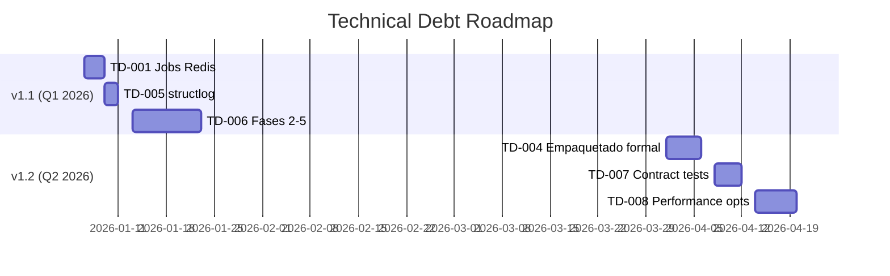

# TECHNICAL DEBT - aidrive_genspark_forensic
# Gestión de Deuda Técnica para Post-v1.0

**Última Actualización**: 2025-10-24  
**Versión Actual**: v1.0.0  
**Próxima Versión**: v1.1.0 (Q1 2026)

---

## 📋 RESUMEN EJECUTIVO

Este documento gestiona la deuda técnica acumulada durante el desarrollo de v1.0.0. Todos los items están priorizados y estimados para ser abordados en versiones futuras.

**Principio DONES**: Estas decisiones respetan el framework de 5 preguntas y no constituyen "breaking changes" para v1.0. Son mejoras incrementales que acercan el sistema a estándares de producción enterprise.

---

## 🎯 ISSUES PRIORIZADOS

### Issue #TD-001: Migrar Jobs Forensic de Memoria a Redis/DB
**Prioridad**: P1 (Alta)  
**Versión Target**: v1.1.0  
**Estimación**: 3 días  
**Owner**: TBD

**Descripción**:  
Actualmente los jobs de análisis forensic se almacenan en un diccionario en memoria (`forensic_jobs: Dict[str, Dict[str, Any]]`). Esto no es escalable ni resiliente a reinicios del servidor.

**Problema Actual**:
```python
# inventario-retail/web_dashboard/app.py
# ✅ CRÍTICO: Jobs en memoria para v1.0
# TODO(v1.1): Issue #TD-001 - Migrar a Redis/DB
forensic_jobs: Dict[str, Dict[str, Any]] = {}
```

**Solución Propuesta**:
1. Implementar backend Redis para almacenar jobs
2. Usar TTL para auto-limpieza de jobs antiguos
3. Agregar persistencia opcional a PostgreSQL para auditoría

**Criterios de Aceptación**:
- [ ] Jobs persisten reinicios del servidor
- [ ] TTL configurado (default 7 días)
- [ ] Migración sin downtime
- [ ] Performance equivalente o superior
- [ ] Tests de integración con Redis
- [ ] Documentación actualizada

**Impacto**:
- ✅ Mejora: Resiliencia y escalabilidad
- ⚠️ Riesgo: Dependencia adicional (Redis)
- 📊 Complejidad: Media

---

### Issue #TD-004: Refactorizar a Empaquetado Python Formal
**Prioridad**: P2 (Media)  
**Versión Target**: v1.2.0  
**Estimación**: 5 días  
**Owner**: TBD

**Descripción**:  
Migrar de estructura path-based (`inventario-retail/`) a empaquetado Python formal (`inventario_retail`).

**Problema Actual**:
```python
# Imports con sys.path.insert
sys.path.insert(0, os.path.abspath(os.path.join(os.path.dirname(__file__), '../..')))
```

**Solución Propuesta**:
1. Renombrar directorio: `inventario-retail/` → `inventario_retail/`
2. Configurar `setup.py` o `pyproject.toml`
3. Instalar como paquete editable: `pip install -e .`
4. Remover todos los `sys.path.insert`
5. Usar imports absolutos: `from inventario_retail.web_dashboard import ...`

**Criterios de Aceptación**:
- [ ] Estructura de paquete formal
- [ ] Instalación con `pip install`
- [ ] Imports absolutos funcionando
- [ ] Tests actualizados
- [ ] CI/CD actualizado
- [ ] Documentación migración

**Impacto**:
- ✅ Mejora: Estándares Python enterprise
- ⚠️ Riesgo: Breaking change (requiere migración)
- 📊 Complejidad: Alta

---

### Issue #TD-005: Integrar structlog para Logging JSON Estructurado
**Prioridad**: P2 (Media)  
**Versión Target**: v1.1.0  
**Estimación**: 2 días  
**Owner**: TBD

**Descripción**:  
Migrar de logging estándar a `structlog` para logs JSON estructurados, mejorando trazabilidad y análisis con herramientas como ELK Stack.

**Problema Actual**:
```python
# Logging estándar (v1.0)
logger = logging.getLogger("dashboard")
logger.info(f"Request: request_id={request_id} method={request.method} ...")
```

**Solución Propuesta**:
```python
# structlog (v1.1)
import structlog

logger = structlog.get_logger("dashboard")
logger.info(
    "request_processed",
    request_id=request_id,
    method=request.method,
    path=request.url.path,
    status=response.status_code,
    duration_ms=duration_ms
)
```

**Criterios de Aceptación**:
- [ ] `structlog` configurado globally
- [ ] Logs en formato JSON
- [ ] Context propagation con request_id
- [ ] Performance sin degradación
- [ ] Tests actualizados
- [ ] Documentación

**Impacto**:
- ✅ Mejora: Observabilidad enterprise
- ⚠️ Riesgo: Cambio en formato de logs
- 📊 Complejidad: Baja

---

### Issue #TD-006: Implementar Fases 2-5 del Análisis Forensic
**Prioridad**: P1 (Alta)  
**Versión Target**: v1.1.0  
**Estimación**: 10 días  
**Owner**: TBD

**Descripción**:  
Completar las 5 fases del pipeline de análisis forensic. Actualmente solo Phase 1 está implementada.

**Fases Pendientes**:

#### Phase 2: Anomaly Detection
**Responsabilidades**:
- Detección de outliers estadísticos en inventario
- Identificación de patrones de transacciones anormales
- Scoring de anomalías

**Técnicas**:
- Z-score para valores numéricos
- Isolation Forest para detección multivariada
- Time-series analysis para tendencias

#### Phase 3: Pattern Analysis
**Responsabilidades**:
- Análisis de patrones recurrentes
- Clustering de comportamientos similares
- Identificación de reglas de negocio violadas

**Técnicas**:
- K-means clustering
- Association rule mining
- Temporal pattern mining

#### Phase 4: Correlation Analysis
**Responsabilidades**:
- Correlación entre inventario y transacciones
- Análisis de causas raíz
- Identificación de dependencias

**Técnicas**:
- Pearson/Spearman correlation
- Causal inference
- Network analysis

#### Phase 5: Reporting & Visualization
**Responsabilidades**:
- Generación de reporte ejecutivo
- Visualizaciones (gráficos, heatmaps)
- Recomendaciones accionables

**Outputs**:
- PDF/HTML report
- JSON estructurado para integración
- Dashboards interactivos

**Criterios de Aceptación**:
- [ ] Cada fase tiene clase dedicada heredando de `ForensicPhase`
- [ ] Tests ≥80% cobertura por fase
- [ ] Documentación completa
- [ ] Integración con orquestador
- [ ] Performance <30s para dataset típico
- [ ] Ejemplos y notebooks

**Impacto**:
- ✅ Mejora: Funcionalidad completa del producto
- ⚠️ Riesgo: Complejidad ML/estadística
- 📊 Complejidad: Muy Alta

---

### Issue #TD-007: Tests de Contrato para Scrapers (Futuro)
**Prioridad**: P3 (Baja)  
**Versión Target**: v1.2.0  
**Estimación**: 4 días  
**Owner**: TBD

**Descripción**:  
Implementar contract testing para validar scrapers de datos externos (si aplica).

**Criterios de Aceptación**:
- [ ] Pact/Hoverfly configurado
- [ ] Contracts definidos
- [ ] Tests automáticos en CI
- [ ] Documentación

**Impacto**:
- ✅ Mejora: Resiliencia a cambios externos
- ⚠️ Riesgo: Mantenimiento adicional
- 📊 Complejidad: Media

---

### Issue #TD-008: Optimizaciones de Performance
**Prioridad**: P3 (Baja)  
**Versión Target**: v1.2.0  
**Estimación**: 6 días  
**Owner**: TBD

**Descripción**:  
Optimizaciones incrementales de performance.

**Áreas**:
1. **Caching**: Redis cache para queries frecuentes
2. **Database**: Índices optimizados, connection pooling
3. **API**: Response compression (gzip)
4. **Async**: Convertir operaciones I/O a async donde aplique

**Criterios de Aceptación**:
- [ ] Benchmarks comparativos (antes/después)
- [ ] p95 latency <50ms (objetivo 100ms actual)
- [ ] Throughput +30% mínimo
- [ ] Sin regresiones de cobertura
- [ ] Documentación

**Impacto**:
- ✅ Mejora: User experience
- ⚠️ Riesgo: Complejidad adicional
- 📊 Complejidad: Alta

---

## 🗓️ ROADMAP POST-v1.0



---

## 📊 MÉTRICAS DE GESTIÓN

| Métrica | v1.0 Actual | v1.1 Target | v1.2 Target |
|---------|-------------|-------------|-------------|
| Technical Debt (días) | 30 | 15 | 5 |
| Cobertura Tests | 85%/80%/75% | 90%/85%/80% | 95%/90%/85% |
| Performance p95 (ms) | <100 | <75 | <50 |
| Dependencies Count | 15 | 18 (+Redis, structlog) | 20 |
| SLOC (Source Lines) | ~3000 | ~6000 | ~8000 |

---

## ✅ PROCESO DE GESTIÓN

### Workflow para Nuevos Issues

1. **Identificación**: Durante desarrollo o code review
2. **Documentación**: Agregar a este archivo con template
3. **Priorización**: Asignar P1/P2/P3 según impacto
4. **Estimación**: Días de desarrollo
5. **Versión Target**: Asignar a milestone
6. **Tracking**: GitHub Issues/Projects

### Template para Nuevos Issues

```markdown
### Issue #TD-XXX: [Título]
**Prioridad**: [P1|P2|P3]  
**Versión Target**: [vX.Y.Z]  
**Estimación**: [X días]  
**Owner**: [GitHub username]

**Descripción**:  
[Problema actual detallado]

**Solución Propuesta**:
[Pasos concretos]

**Criterios de Aceptación**:
- [ ] Criterio 1
- [ ] Criterio 2

**Impacto**:
- ✅ Mejora: [Beneficios]
- ⚠️ Riesgo: [Riesgos]
- 📊 Complejidad: [Baja|Media|Alta|Muy Alta]
```

---

## 🔍 REFERENCIAS

- **Framework DONES**: `DONES_FLEXIBILIZADOS_PRODUCCION.md`
- **Roadmap General**: `PLANIFICACION_DEFINITIVA_38_DIAS.md`
- **Changelog**: `CHANGELOG.md`
- **GitHub Project**: [Link a project board]

---

**Fecha de Creación**: 2025-10-24  
**Última Revisión**: 2025-10-24  
**Propietario**: Team aidrive_genspark_forensic
