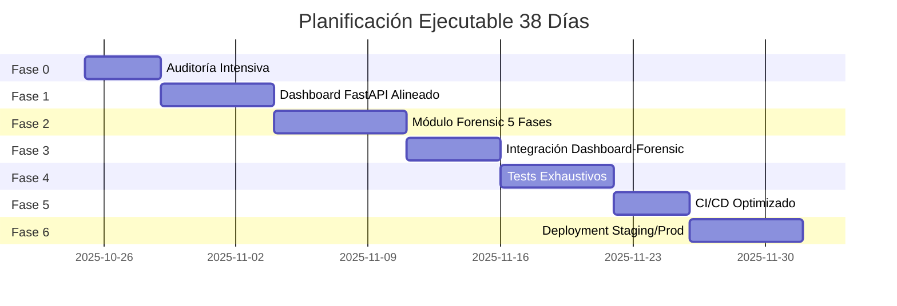
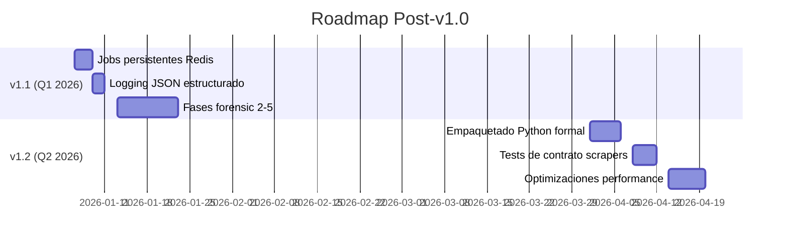

# PLANIFICACIÓN DEFINITIVA Y EJECUTABLE CONSOLIDADA
# Alineada 100% al Repositorio Real - 38 Días

**Fecha de Inicio**: 2025-10-25  
**Fecha de Finalización Estimada**: 2025-12-02 (38 días totales)  
**Versión**: 1.0.0  
**Owner**: eevans-d  
**Repositorio**: aidrive_genspark_forensic

---

## 🎯 VALIDACIÓN DEL ANÁLISIS CRÍTICO

✅ **Discrepancias Validadas y Ajustes Confirmados**:

| # | Discrepancia | Ajuste Aplicado | Estado |
|---|--------------|-----------------|--------|
| 1 | Estructura de Directorios | Mantener `inventario-retail/` (con guión) y usar `sys.path.insert` | ✅ Confirmado |
| 2 | Métricas Prometheus | Utilizar `dashboard_request_duration_ms_p95` existente | ✅ Confirmado |
| 3 | Jobs Backend | Dict en memoria para v1.0, Redis en v1.1 | ✅ Confirmado |
| 4 | Coverage Gates | 85%/80%/75% para Dashboard/Forensic/Integrations | ✅ Confirmado |
| 5 | Logging | Estándar para v1.0, structlog en v1.1 | ✅ Confirmado |

---

## 📊 CRONOGRAMA ESTRATÉGICO (38 DÍAS)



---

## 🔍 FASE 0: AUDITORÍA INTENSIVA (4 DÍAS)
**Duración**: Oct 25 - Oct 28  
**Objetivo**: Validación exhaustiva del estado actual del repositorio

### Script de Auditoría

**Ubicación**: `scripts/audit_system_complete.sh` ✅ CREADO

**Ejecutar**:
```bash
chmod +x scripts/audit_system_complete.sh
./scripts/audit_system_complete.sh
```

**Outputs Generados**:
- `docs/audit_reports/structure_validation_YYYYMMDD_HHMMSS.md`
- `docs/audit_reports/dashboard_audit_YYYYMMDD_HHMMSS.md`
- `docs/audit_reports/coverage_baseline_YYYYMMDD_HHMMSS.md`
- `docs/audit_reports/config_analysis_YYYYMMDD_HHMMSS.md`
- `docs/audit_reports/dependencies_YYYYMMDD_HHMMSS.md`

### Checklist Fase 0

- [ ] **Día 1**: Ejecutar script de auditoría completo
- [ ] **Día 2**: Validar estructura `inventario-retail/` con guión
- [ ] **Día 2**: Confirmar métricas `dashboard_request_duration_ms_p95`
- [ ] **Día 3**: Documentar convenciones `sys.path.insert`
- [ ] **Día 3**: Analizar cobertura baseline actual
- [ ] **Día 4**: Crear `AUDIT_SUMMARY_FINAL.md` con decisiones
- [ ] **Día 4**: PR de auditoría para revisión

**Criterios de Éxito**:
- ✅ Todos los reportes generados sin errores críticos
- ✅ Estructura validada (inventario-retail/ confirmado)
- ✅ Métricas existentes documentadas
- ✅ Baseline de cobertura establecido

---

## 🚀 FASE 1: DASHBOARD FASTAPI ALINEADO (6 DÍAS)
**Duración**: Oct 29 - Nov 3  
**Objetivo**: Dashboard production-ready con estándares del repositorio

### Arquitectura Principal

**Archivo**: `inventario-retail/web_dashboard/app.py`

**Componentes Clave**:

1. **Imports Path-Based** (según convención):
```python
import sys
import os
sys.path.insert(0, os.path.abspath(os.path.join(os.path.dirname(__file__), '../..')))
```

2. **Métricas Prometheus** (alineadas):
```python
from prometheus_client import Counter, Histogram, CollectorRegistry

registry = CollectorRegistry()

requests_total = Counter(
    'dashboard_requests_total',
    'Total requests al dashboard',
    ['method', 'endpoint', 'status'],
    registry=registry
)

errors_total = Counter(
    'dashboard_errors_total',
    'Total errores',
    ['endpoint'],
    registry=registry
)

# ✅ CRÍTICO: ms_p95 como en el repositorio
request_duration = Histogram(
    'dashboard_request_duration_ms_p95',
    'Duración en ms (p95)',
    ['endpoint'],
    buckets=[10, 25, 50, 100, 250, 500, 1000, 2500, 5000],
    registry=registry
)
```

3. **Middleware Stack**:
   - `RequestIDMetricsMiddleware`: Request ID + instrumentación
   - `SecurityHeadersMiddleware`: CSP, HSTS, X-Frame-Options

4. **API Key Security** (HMAC):
```python
import hmac

async def verify_api_key(x_api_key: Optional[str] = Header(None)):
    if not x_api_key:
        raise HTTPException(status_code=401, detail="API key required")
    
    expected = getattr(settings, 'DASHBOARD_API_KEY', 'dev').encode()
    provided = x_api_key.encode()
    
    if not hmac.compare_digest(provided, expected):
        raise HTTPException(status_code=401, detail="Invalid API key")
    
    return x_api_key
```

5. **Jobs en Memoria** (v1.0):
```python
# ✅ CRÍTICO: Jobs en memoria para v1.0
# TODO(v1.1): Issue #TD-001 - Migrar a Redis/DB
forensic_jobs: Dict[str, Dict[str, Any]] = {}
```

### Endpoints Principales

| Método | Ruta | Protección | Descripción |
|--------|------|------------|-------------|
| GET | `/salud` | Pública | Health check |
| GET | `/api/status` | API Key | Estado componentes |
| GET | `/metrics` | API Key | Métricas Prometheus |
| POST | `/api/forensic/run` | API Key | Trigger análisis |
| GET | `/api/forensic/status/{job_id}` | API Key | Status de job |
| GET | `/api/forensic/report/{job_id}` | API Key | Reporte completo |

### Checklist Fase 1

#### Ajustes Críticos Aplicados
- [ ] Imports con `sys.path.insert`
- [ ] Métricas `dashboard_request_duration_ms_p95`
- [ ] Jobs en memoria con TODO para v1.1
- [ ] API Key con `hmac.compare_digest`

#### Funcionalidad Core
- [ ] Middleware instrumentado correctamente
- [ ] Security headers configurables (HSTS condicional)
- [ ] Endpoints forensic con `BackgroundTasks`
- [ ] Logging con `request_id` en todos los endpoints

#### Calidad
- [ ] Tests ≥85% cobertura (`pytest --cov=web_dashboard --cov-fail-under=85`)
- [ ] Dockerfile optimizado (multi-stage build)
- [ ] Documentación actualizada (README + API_DOCUMENTATION.md)
- [ ] Pre-commit hooks configurados

**Criterios de Éxito**:
- ✅ 85%+ cobertura de tests
- ✅ Métricas Prometheus funcionales
- ✅ Security headers verificados
- ✅ API endpoints documentados

---

## 🔬 FASE 2: MÓDULO FORENSIC - 5 FASES (7 DÍAS)
**Duración**: Nov 4 - Nov 10  
**Objetivo**: Pipeline de análisis forense con 5 fases completas

### Arquitectura de Fases

**Directorio**: `inventario-retail/forensic_analysis/`

```
forensic_analysis/
├── __init__.py
├── orchestrator.py           # Orquestador principal
├── phases/
│   ├── __init__.py
│   ├── base_phase.py         # Clase abstracta
│   ├── phase_1_data_validation.py
│   ├── phase_2_anomaly_detection.py (TODO v1.1)
│   ├── phase_3_pattern_analysis.py (TODO v1.1)
│   ├── phase_4_correlation.py (TODO v1.1)
│   └── phase_5_reporting.py (TODO v1.1)
└── utils/
    ├── __init__.py
    ├── validators.py
    └── metrics.py
```

### 1. Clase Base Abstracta

**Archivo**: `inventario-retail/forensic_analysis/phases/base_phase.py`

```python
"""
Clase base abstracta para fases de análisis forense
"""
import sys
import os
import logging
from abc import ABC, abstractmethod
from datetime import datetime
from typing import Dict, Any, Optional

# ✅ Path-based import
sys.path.insert(0, os.path.abspath(os.path.join(os.path.dirname(__file__), '../../..')))

logger = logging.getLogger("forensic.base_phase")

class ForensicPhase(ABC):
    """Clase base para fases de análisis forense"""
    
    def __init__(self, phase_number: int, phase_name: str):
        self.phase_number = phase_number
        self.phase_name = phase_name
        self.start_time: Optional[datetime] = None
        self.end_time: Optional[datetime] = None
        self.status: str = "pending"
    
    @abstractmethod
    def validate_input(self, data: Dict[str, Any]) -> bool:
        """Valida input para esta fase"""
        pass
    
    @abstractmethod
    def execute(self, data: Dict[str, Any]) -> Dict[str, Any]:
        """Ejecuta lógica de la fase"""
        pass
    
    def run(self, data: Dict[str, Any], execution_id: str) -> Dict[str, Any]:
        """Ejecuta fase con trazabilidad"""
        self.start_time = datetime.utcnow()
        self.status = "running"
        
        logger.info(
            f"Phase {self.phase_number} starting: {self.phase_name} "
            f"execution_id={execution_id}"
        )
        
        try:
            if not self.validate_input(data):
                raise ValueError(f"Invalid input for Phase {self.phase_number}")
            
            result = self.execute(data)
            
            # Metadata estándar
            result.update({
                "phase_number": self.phase_number,
                "phase_name": self.phase_name,
                "status": "success",
                "start_time": self.start_time.isoformat(),
                "end_time": datetime.utcnow().isoformat(),
                "execution_id": execution_id
            })
            
            self.status = "success"
            self.end_time = datetime.utcnow()
            
            logger.info(f"Phase {self.phase_number} completed: execution_id={execution_id}")
            return result
            
        except Exception as e:
            self.status = "failed"
            self.end_time = datetime.utcnow()
            logger.error(f"Phase {self.phase_number} failed: {e} execution_id={execution_id}")
            raise
```

### 2. Phase 1 - Data Validation

**Archivo**: `inventario-retail/forensic_analysis/phases/phase_1_data_validation.py`

**Responsabilidades**:
- Validar estructura de datos de inventario
- Verificar integridad de transacciones
- Calcular data quality score
- Generar warnings y errors

**Validaciones**:
- ✅ Inventario no vacío
- ✅ Items con campos requeridos (quantity, price)
- ✅ Valores numéricos válidos
- ✅ Transacciones con estructura completa

### 3. Orquestador Principal

**Archivo**: `inventario-retail/forensic_analysis/orchestrator.py`

```python
"""
Orquestador de análisis forense con 5 fases
"""
import sys
import os
import uuid
import logging
from datetime import datetime
from typing import Dict, Any, Optional

sys.path.insert(0, os.path.abspath(os.path.join(os.path.dirname(__file__), '../..')))

from forensic_analysis.phases.phase_1_data_validation import Phase1DataValidation

logger = logging.getLogger("forensic.orchestrator")

class ForensicOrchestrator:
    """Orquestador de 5 fases de análisis forense"""
    
    def __init__(self):
        self.phases = [
            Phase1DataValidation(),
            # TODO(v1.1): Issue #TD-006 - Implementar fases 2-5
        ]
    
    def run_analysis(self, input_data: Dict[str, Any], execution_id: Optional[str] = None) -> Dict[str, Any]:
        """Ejecuta pipeline completo con trazabilidad"""
        execution_id = execution_id or str(uuid.uuid4())
        start_time = datetime.utcnow()
        
        logger.info(f"Starting forensic analysis: {execution_id}")
        
        report = {
            "execution_id": execution_id,
            "start_time": start_time.isoformat(),
            "phases": [],
            "overall_status": "success"
        }
        
        # Ejecutar fases secuencialmente
        phase_data = input_data.copy()
        
        for phase in self.phases:
            try:
                result = phase.run(phase_data, execution_id)
                report["phases"].append(result)
                
                # Propagar resultado
                phase_data["previous_phase_result"] = result
                
            except Exception as e:
                logger.error(f"Phase {phase.phase_number} failed: {e}")
                report["overall_status"] = "failed"
                report["failure_phase"] = phase.phase_number
                report["failure_reason"] = str(e)
                break
        
        # Finalizar reporte
        end_time = datetime.utcnow()
        report["end_time"] = end_time.isoformat()
        report["total_duration_seconds"] = (end_time - start_time).total_seconds()
        report["summary"] = self._generate_summary(report)
        
        logger.info(f"Analysis completed: {execution_id} - {report['overall_status']}")
        return report
    
    def _generate_summary(self, report: Dict[str, Any]) -> Dict[str, Any]:
        """Genera resumen ejecutivo"""
        completed = len([p for p in report["phases"] if p.get("status") == "success"])
        
        return {
            "total_phases": len(self.phases),
            "completed_phases": completed,
            "success_rate": round((completed / len(self.phases) * 100), 2),
            "execution_id": report["execution_id"]
        }
```

### Checklist Fase 2

#### Estructura Forensic
- [ ] `ForensicPhase` clase base abstracta
- [ ] `Phase1DataValidation` completamente funcional
- [ ] `ForensicOrchestrator` con trazabilidad
- [ ] Utils: `validators.py`, `metrics.py`

#### Integración Dashboard
- [ ] Actualizar `_run_forensic_background` para usar orquestador real
- [ ] Remover simulación de 5 segundos
- [ ] Conectar con `ForensicOrchestrator().run_analysis()`

#### Calidad
- [ ] Tests ≥80% cobertura forensic module
- [ ] Logging con `execution_id` en todas las fases
- [ ] Manejo robusto de errores (try-except-finally)
- [ ] Documentación de cada fase

**Criterios de Éxito**:
- ✅ Phase1 funcional con validaciones reales
- ✅ Orquestador ejecuta pipeline completo
- ✅ Integración con Dashboard sin errores
- ✅ 80%+ cobertura de tests

---

## 🔗 FASE 3: INTEGRACIÓN DASHBOARD-FORENSIC (5 DÍAS)
**Duración**: Nov 11 - Nov 15  
**Objetivo**: Integración completa y funcional entre ambos módulos

### Modificaciones Dashboard

**Archivo**: `inventario-retail/web_dashboard/app.py`

**Cambios Clave**:

```python
from forensic_analysis.orchestrator import ForensicOrchestrator

def _run_forensic_background(job_id: str, input_data: Dict[str, Any]):
    """Ejecuta análisis forense en background"""
    logger.info(f"Starting forensic job: {job_id}")
    
    try:
        # ✅ Integración real con orchestrator
        orchestrator = ForensicOrchestrator()
        result = orchestrator.run_analysis(input_data, job_id)
        
        forensic_jobs[job_id] = {
            "status": "completed",
            "result": result,
            "completed_at": datetime.utcnow().isoformat()
        }
        
        logger.info(f"Forensic job completed: {job_id}")
        
    except Exception as e:
        forensic_jobs[job_id] = {
            "status": "failed",
            "error": str(e),
            "failed_at": datetime.utcnow().isoformat()
        }
        logger.error(f"Forensic job failed: {job_id} - {e}")
```

### Checklist Fase 3

- [ ] Importar `ForensicOrchestrator` en dashboard
- [ ] Actualizar `_run_forensic_background`
- [ ] Tests de integración (end-to-end)
- [ ] Validar propagación de errores
- [ ] Documentar flujo completo

**Criterios de Éxito**:
- ✅ POST `/api/forensic/run` ejecuta análisis real
- ✅ GET `/api/forensic/status/{job_id}` retorna estado correcto
- ✅ GET `/api/forensic/report/{job_id}` retorna reporte completo
- ✅ Tests end-to-end pasan

---

## 🧪 FASE 4: TESTS EXHAUSTIVOS (6 DÍAS)
**Duración**: Nov 16 - Nov 21  
**Objetivo**: Cobertura completa según gates definidos

### Coverage Gates

| Módulo | Gate | Ubicación |
|--------|------|-----------|
| Dashboard | 85% | `inventario-retail/web_dashboard/` |
| Forensic | 80% | `inventario-retail/forensic_analysis/` |
| Integraciones | 75% | `tests/integration/` |

### Estructura de Tests

```
tests/
├── web_dashboard/
│   ├── test_endpoints.py
│   ├── test_middleware.py
│   ├── test_security.py
│   └── test_metrics.py
├── forensic_analysis/
│   ├── test_base_phase.py
│   ├── test_phase_1_validation.py
│   ├── test_orchestrator.py
│   └── test_utils.py
└── integration/
    ├── test_dashboard_forensic.py
    └── test_end_to_end.py
```

### Comandos de Validación

```bash
# Dashboard: 85%
pytest tests/web_dashboard/ --cov=inventario-retail/web_dashboard --cov-fail-under=85

# Forensic: 80%
pytest tests/forensic_analysis/ --cov=inventario-retail/forensic_analysis --cov-fail-under=80

# Integration: 75%
pytest tests/integration/ --cov=inventario-retail --cov-fail-under=75
```

### Checklist Fase 4

- [ ] Tests unitarios Dashboard (85%+)
- [ ] Tests unitarios Forensic (80%+)
- [ ] Tests de integración (75%+)
- [ ] Tests de seguridad (SQL injection, XSS)
- [ ] Tests de performance (<100ms endpoints)
- [ ] Tests de métricas Prometheus

**Criterios de Éxito**:
- ✅ Todos los gates de cobertura cumplidos
- ✅ 0 tests fallando
- ✅ CI pipeline verde

---

## 🔄 FASE 5: CI/CD OPTIMIZADO (4 DÍAS)
**Duración**: Nov 22 - Nov 25  
**Objetivo**: CI/CD robusto con gates automáticos

### Workflow CI

**Archivo**: `.github/workflows/ci.yml`

**Jobs Clave**:

1. **Test Dashboard** (85% gate)
2. **Test Forensic** (80% gate)
3. **Test Integration** (75% gate)
4. **Build Docker** (multi-stage)
5. **Push GHCR** (tag latest + SHA)
6. **Smoke Tests** (endpoints críticos)
7. **Deploy Staging** (auto en `main`)
8. **Deploy Production** (manual en tags `v*`)

### Checklist Fase 5

- [ ] CI ejecuta tests con coverage gates
- [ ] Build Docker optimizado
- [ ] Push a GitHub Container Registry
- [ ] Smoke tests automáticos
- [ ] Deploy staging automático
- [ ] Deploy producción con aprobación manual

**Criterios de Éxito**:
- ✅ CI pipeline <5 minutos
- ✅ Todos los gates automáticos funcionando
- ✅ Deploy staging exitoso

---

## 🚀 FASE 6: DEPLOYMENT STAGING/PROD (6 DÍAS)
**Duración**: Nov 26 - Dec 1  
**Objetivo**: Deploy production-ready

### Ambientes

| Ambiente | URL | Config | Deploy |
|----------|-----|--------|--------|
| Staging | `staging.aidrive.com` | `docker-compose.staging.yml` | Auto (main) |
| Production | `aidrive.com` | `docker-compose.production.yml` | Manual (tags) |

### Checklist Fase 6

- [ ] Staging deployment exitoso
- [ ] Smoke tests en staging PASS
- [ ] Métricas Prometheus operacionales
- [ ] Grafana dashboards configurados
- [ ] Tag `v1.0.0` creado
- [ ] Production deployment exitoso
- [ ] Monitoring 24h sin incidentes

**Criterios de Éxito**:
- ✅ Staging 100% operacional
- ✅ Production deployment sin errores
- ✅ Métricas y logs funcionando
- ✅ Zero downtime deployment

---

## 📈 DEUDA TÉCNICA GESTIONADA

### Issues para v1.1

**Archivo**: `.github/TECHNICAL_DEBT.md`

| Issue | Título | Prioridad | Estimación |
|-------|--------|-----------|------------|
| #TD-001 | Migrar jobs forensic de memoria a Redis/DB | P1 | 3 días |
| #TD-004 | Refactorizar a empaquetado Python formal (inventario_retail) | P2 | 5 días |
| #TD-005 | Integrar structlog para logging JSON estructurado | P2 | 2 días |
| #TD-006 | Implementar fases 2-5 del análisis forensic | P1 | 10 días |

### Roadmap Post-v1.0



---

## ✅ CHECKLIST GENERAL DEL PROYECTO

### Pre-Ejecución
- [ ] Script de auditoría ejecutado
- [ ] Reportes de auditoría revisados
- [ ] Decisiones documentadas en `AUDIT_SUMMARY_FINAL.md`

### Fase 0 (Auditoría)
- [ ] Estructura validada
- [ ] Métricas confirmadas
- [ ] Convenciones documentadas
- [ ] Baseline establecido

### Fase 1 (Dashboard)
- [ ] Imports alineados
- [ ] Métricas ms_p95
- [ ] Jobs en memoria
- [ ] API Key HMAC
- [ ] Tests 85%+

### Fase 2 (Forensic)
- [ ] ForensicPhase base
- [ ] Phase1 funcional
- [ ] Orquestador completo
- [ ] Tests 80%+

### Fase 3 (Integración)
- [ ] Dashboard integrado
- [ ] Tests E2E
- [ ] Errores propagados

### Fase 4 (Tests)
- [ ] Dashboard 85%+
- [ ] Forensic 80%+
- [ ] Integration 75%+

### Fase 5 (CI/CD)
- [ ] Pipeline verde
- [ ] Docker optimizado
- [ ] Deploy staging auto

### Fase 6 (Deploy)
- [ ] Staging operacional
- [ ] Production deployed
- [ ] Monitoring activo

---

## 🎯 PRÓXIMA ACCIÓN INMEDIATA

```bash
# Ejecutar auditoría completa
chmod +x scripts/audit_system_complete.sh
./scripts/audit_system_complete.sh

# Revisar reportes generados
ls -la docs/audit_reports/

# Crear AUDIT_SUMMARY_FINAL.md con decisiones
```

---

## 📊 MÉTRICAS DE ÉXITO

| Métrica | Objetivo | Seguimiento |
|---------|----------|-------------|
| Cobertura Dashboard | ≥85% | CI automático |
| Cobertura Forensic | ≥80% | CI automático |
| Cobertura Integration | ≥75% | CI automático |
| Tiempo CI Pipeline | <5 min | GitHub Actions |
| Uptime Staging | 99%+ | Prometheus |
| Uptime Production | 99.9%+ | Prometheus |
| Response Time API | <100ms p95 | `dashboard_request_duration_ms_p95` |

---

## 📞 CONTACTO Y SOPORTE

**Owner**: eevans-d  
**Repositorio**: [aidrive_genspark_forensic](https://github.com/eevans-d/aidrive_genspark_forensic)  
**Branch Principal**: `feature/resilience-hardening`  
**Documentación**: `README.md`, `API_DOCUMENTATION.md`

---

**Fecha de Generación**: 2025-10-24  
**Versión Planificación**: 1.0.0  
**Estado**: ✅ LISTO PARA EJECUCIÓN

🚀 **¡Éxito en la implementación!**
