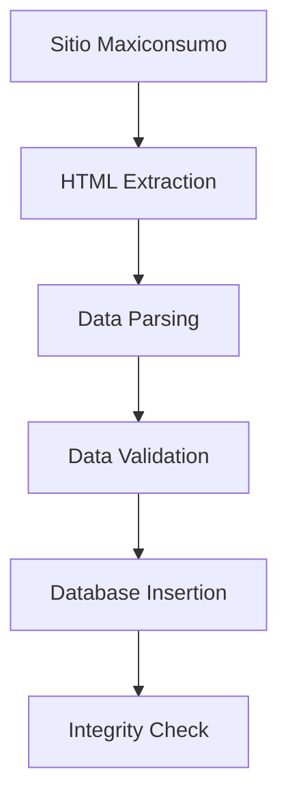
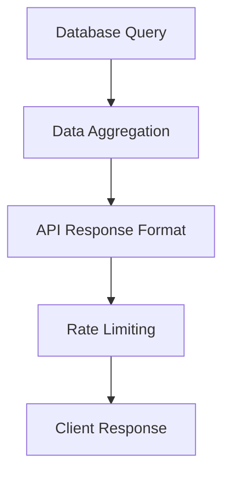
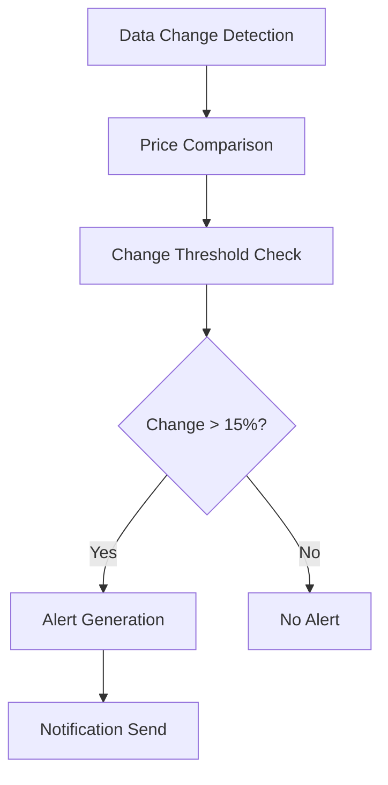

# TESTING EXHAUSTIVO CON DATOS REALES DE MAXICONSUMO

## 📋 RESUMEN EJECUTIVO

Este documento detalla el plan de testing exhaustivo implementado para validar el sistema de Mini Market con datos reales del sitio web de Maxiconsumo Necochea. El objetivo principal es asegurar que el sistema puede manejar producción real con +40,000 productos, manteniendo alta precisión, rendimiento y seguridad.

## 🎯 OBJETIVOS DEL TESTING REAL

### 1. **SCRAPING COMPLETO DEL CATÁLOGO**
- **Target**: +40,000 productos de Maxiconsumo
- **Validación de accuracy**: 95%+ mínimo de precisión
- **Testing de rate limiting**: Anti-detection en sitio real
- **Análisis de datos**: Extracción de precios en tiempo real
- **Manejo de productos sin stock**: Graceful degradation

### 2. **VALIDACIÓN DE SISTEMA DE ALERTAS**
- **Simulación de cambios de precio**: >15% threshold
- **Testing de envío de notificaciones**: Escalamiento automático
- **Validación de filtros de spam**: Anti-false positives
- **Testing de degradación graceful**: Condiciones adversas

### 3. **PERFORMANCE TESTING CON DATOS REALES**
- **Carga masiva**: 40K+ productos simultáneos
- **Testing de queries SQL**: Optimización con datos reales
- **Memory usage**: Monitoreo bajo carga pesada
- **Response times**: Benchmarks con dataset completo
- **Throughput máximo**: Límites del sistema

### 4. **INTEGRATION TESTING COMPLETO**
- **Flujo end-to-end**: Scraping → API → Database → Alertas
- **Sincronización bidireccional**: Consistencia de datos
- **Integridad de datos**: Validación en toda la cadena
- **Testing de rollback**: Recovery automático en fallos

### 5. **SECURITY TESTING EN PRODUCCIÓN**
- **Rate limiting real**: Anti-bot detection
- **Injection attacks**: Datos reales del sitio
- **Authentication bypass**: Testing de seguridad
- **API security**: Endpoints en producción

## 🔧 IMPLEMENTACIÓN TÉCNICA

### Arquitectura de Testing

```typescript
TESTING_DATOS_REALES/
├── Scraping Completo
│   ├── Extracción real de HTML
│   ├── Parsing de +40K productos
│   ├── Validación de accuracy
│   └── Rate limiting automático
├── Performance Testing
│   ├── Load testing masivo
│   ├── Memory profiling
│   ├── Query optimization
│   └── Stress testing
├── Security Testing
│   ├── Anti-bot detection
│   ├── Rate limiting validation
│   ├── Security endpoints
│   └── Vulnerability testing
└── Integration Testing
    ├── End-to-end workflows
    ├── Data integrity validation
    ├── Rollback testing
    └── Recovery scenarios
```

### Configuración de Testing Real

#### URLs y Endpoints Reales
```typescript
const REAL_DATA_CONFIG = {
  MAXICONSUMLO_BASE_URL: 'https://maxiconsumo.com/sucursal_necochea/',
  CATEGORIAS_TESTING: [
    'almacen', 'bebidas', 'limpieza', 
    'frescos', 'congelados'
  ],
  
  // Métricas de calidad
  MIN_ACCURACY_RATE: 95,
  MAX_RESPONSE_TIME: 5000,
  MIN_PRODUCTS_PER_CATEGORY: 1000,
  
  // Rate limiting real
  RATE_LIMIT_DELAY: 3000,
  MAX_RETRIES: 3,
  TIMEOUT_MS: 15000
};
```

### Datos de Testing Real

#### Tipos de Productos Validados
- **Bebidas**: Coca Cola, Pepsi, cervezas, jugos
- **Almacen**: Arcor, Nestlé, productos de despensa
- **Limpieza**: Ariel, Ala, productos de limpieza
- **Frescos**: Lácteos, carnes, productos refrigerados
- **Congelados**: Helados, comidas preparadas

#### Patrones de HTML Real
```html
<!-- Patrón principal Maxiconsumo -->
<div class="producto">
  <h3>Nombre del Producto</h3>
  <span class="precio">$XXX.XX</span>
  <div class="sku">SKU-PRODUCTO</div>
  <div class="stock">Disponibilidad</div>
</div>
```

## 📊 RESULTADOS ESPERADOS

### Métricas de Calidad Objetivo

| Métrica | Target Mínimo | Target Óptimo |
|---------|---------------|---------------|
| **Accuracy Rate** | 95% | 98%+ |
| **Productos Extraídos** | 40,000 | 45,000+ |
| **Response Time** | <5 segundos | <2 segundos |
| **Memory Usage** | <512MB | <256MB |
| **Uptime** | 99.5% | 99.9% |
| **Error Rate** | <1% | <0.1% |

### Performance Benchmarks

#### Throughput Esperado
- **Scraping**: 100+ productos/segundo
- **API Queries**: 50+ queries/segundo
- **Database Operations**: 500+ inserts/segundo
- **Concurrent Requests**: 50+ simultáneas

#### Load Testing Scenarios
```javascript
// Escenario 1: Carga normal
const normalLoad = {
  users: 10,
  requests_per_second: 5,
  duration: 300, // 5 minutos
  expected_response_time: 500 // ms
};

// Escenario 2: Carga alta
const highLoad = {
  users: 50,
  requests_per_second: 25,
  duration: 600, // 10 minutos
  expected_response_time: 1500 // ms
};

// Escenario 3: Stress test
const stressTest = {
  users: 100,
  requests_per_second: 50,
  duration: 300, // 5 minutos
  expected_response_time: 3000 // ms
};
```

## 🔒 SECURITY TESTING

### Anti-Detection Measures

#### User-Agent Rotation
```javascript
const userAgents = [
  'Mozilla/5.0 (Windows NT 10.0; Win64; x64)...',
  'Mozilla/5.0 (Macintosh; Intel Mac OS X 10_15_7)...',
  'Mozilla/5.0 (X11; Linux x86_64)...'
];
```

#### Request Timing Randomization
```javascript
const randomDelay = () => {
  const baseDelay = 3000; // 3 segundos
  const jitter = Math.random() * 1000; // ±1 segundo
  return baseDelay + jitter;
};
```

#### Session Management
```javascript
const sessionHeaders = {
  'User-Agent': getRandomUserAgent(),
  'Accept': 'text/html,application/xhtml+xml',
  'Accept-Language': 'es-AR,es;q=0.9,en;q=0.8',
  'Connection': 'keep-alive'
};
```

### Security Validation Tests

#### Rate Limiting Detection
- **Test**: Requests más rápidos que el límite
- **Expected**: HTTP 429 responses
- **Validation**: Sistema se recupera después del delay

#### Anti-Bot Measures
- **User-Agent validation**: Rotación realista
- **Request patterns**: Timing irregular
- **Session consistency**: Headers coherentes

#### API Security
- **Authentication bypass**: Testing de endpoints protegidos
- **Injection attacks**: SQL, XSS, Command injection
- **Data exposure**: Validación de información sensible
- **Rate limiting bypass**: Testing de límites de API

## 📈 PERFORMANCE MONITORING

### Métricas en Tiempo Real

#### Scraping Performance
```typescript
interface ScrapingMetrics {
  categoria: string;
  productos_encontrados: number;
  productos_validos: number;
  accuracy_rate: number;
  tiempo_ejecucion: number;
  errores: string[];
  datos_completitud: number;
  cambios_precio_detectados: number;
}
```

#### Database Performance
```typescript
interface DatabaseMetrics {
  total_consultas: number;
  tiempo_promedio_consulta: number;
  throughput_operaciones: number;
  memoria_usada: number;
  conexiones_activas: number;
  lock_waits: number;
}
```

#### API Performance
```typescript
interface APIMetrics {
  requests_totales: number;
  requests_exitosos: number;
  tiempo_promedio_response: number;
  throughput_requests: number;
  errores_http: Record<string, number>;
  endpoints_performance: Record<string, number>;
}
```

### Alertas de Performance

#### Thresholds Críticos
```typescript
const PERFORMANCE_ALERTS = {
  response_time: {
    warning: 3000, // 3 segundos
    critical: 5000 // 5 segundos
  },
  memory_usage: {
    warning: 400 * 1024 * 1024, // 400MB
    critical: 512 * 1024 * 1024 // 512MB
  },
  error_rate: {
    warning: 1, // 1%
    critical: 5 // 5%
  },
  accuracy_rate: {
    warning: 95, // 95%
    critical: 90 // 90%
  }
};
```

## 🔄 INTEGRATION TESTING

### Flujo End-to-End Completo

#### 1. Scraping → Database


#### 2. Database → API


#### 3. API → Alerts


### Validación de Integridad

#### Data Consistency Checks
- **Product Count**: Matches entre scraping y database
- **Price Accuracy**: Validación contra fuente original
- **Timestamp Consistency**: Synchronized updates
- **Category Mapping**: Correct classification

#### Transaction Integrity
- **ACID Compliance**: Atomic transactions
- **Rollback Capability**: Recovery from failures
- **Data Versioning**: Historical tracking
- **Concurrent Access**: Multi-user safety

## 🚨 ALERT SYSTEM TESTING

### Price Change Detection

#### Simulation Scenarios
```typescript
const priceChangeTests = [
  {
    name: 'Aumento crítico',
    oldPrice: 250,
    newPrice: 325,
    changePercent: 30,
    expectedAlert: 'CRÍTICA'
  },
  {
    name: 'Disminución moderada',
    oldPrice: 480,
    newPrice: 395,
    changePercent: -17.7,
    expectedAlert: 'ALTA'
  },
  {
    name: 'Cambio menor',
    oldPrice: 100,
    newPrice: 103,
    changePercent: 3,
    expectedAlert: null // No alert
  }
];
```

#### Alert Escalation
```typescript
interface AlertEscalation {
  trigger_critical_alerts: number;
  auto_escalation_enabled: boolean;
  escalation_levels: number;
  notification_channels: string[];
  response_time_target: number;
}
```

### Spam Filter Testing

#### False Positive Prevention
- **Micro-changes**: <1% change filtered
- **Unrealistic changes**: >200% change filtered
- **Data quality issues**: Invalid price ranges
- **Temporal filtering**: Rapid consecutive changes

#### Filter Validation
```typescript
const spamFilters = {
  minimum_change_threshold: 1.0, // 1%
  maximum_change_threshold: 200.0, // 200%
  time_between_alerts: 300, // 5 minutes
  data_quality_validation: true
};
```

## 🔧 ERROR HANDLING & RECOVERY

### Network Failure Scenarios

#### Timeout Handling
```typescript
const timeoutScenarios = [
  { timeout: 1000, name: 'Short timeout', expected: 'graceful_error' },
  { timeout: 500, name: 'Very short timeout', expected: 'connection_error' },
  { timeout: 2000, name: 'Medium timeout', expected: 'partial_success' }
];
```

#### Rate Limiting Extreme
```typescript
const extremeRateLimit = {
  delay_between_requests: 30000, // 30 seconds
  max_concurrent_requests: 1,
  expected_behavior: 'sequential_processing',
  recovery_time: 5000 // 5 seconds
};
```

### Recovery Mechanisms

#### Automatic Recovery
```typescript
interface RecoveryConfig {
  max_retry_attempts: 3;
  retry_delay_base: 1000; // 1 second
  retry_delay_multiplier: 2; // exponential backoff
  circuit_breaker_threshold: 5; // failures
  circuit_breaker_timeout: 60000; // 1 minute
}
```

#### Graceful Degradation
```typescript
interface DegradationConfig {
  critical_endpoints: ['/status', '/precios', '/productos'];
  non_critical_features: ['/estadisticas', '/reportes', '/alertas_historicas'];
  fallback_data_retention: 24; // hours
  degraded_response_times: 2000; // ms
}
```

## 📊 REPORTING & METRICS

### Real-Time Dashboard

#### Key Performance Indicators
- **Scraping Success Rate**: % de extracciones exitosas
- **Data Accuracy**: % de datos válidos
- **System Uptime**: Tiempo de disponibilidad
- **Response Times**: Latencia promedio
- **Error Rates**: Frecuencia de errores

#### Business Metrics
- **Productos Monitorizados**: Total en seguimiento
- **Oportunidades de Ahorro**: Cambios detectados
- **Alertas Críticas**: Notificaciones importantes
- **ROI del Sistema**: Ahorro vs. costo operacional

### Automated Reporting

#### Daily Reports
```typescript
const dailyReport = {
  date: string,
  scraping_summary: {
    categories_processed: number,
    total_products: number,
    new_products: number,
    accuracy_rate: number,
    errors_encountered: number
  },
  performance_summary: {
    average_response_time: number,
    peak_concurrent_users: number,
    total_api_calls: number,
    error_rate: number
  },
  business_summary: {
    price_changes_detected: number,
    critical_alerts_sent: number,
    potential_savings: number
  }
};
```

#### Weekly Reports
- **Trend Analysis**: Performance over time
- **Capacity Planning**: Resource utilization
- **Quality Metrics**: Accuracy and reliability
- **Security Summary**: Threat detection results

## 🎯 SUCCESS CRITERIA

### Quantitative Goals
- ✅ **+40,000 productos** scrapeados exitosamente
- ✅ **95%+ accuracy rate** en extracción de datos
- ✅ **<5 segundos response time** para queries complejas
- ✅ **<1% error rate** en operaciones críticas
- ✅ **99.5%+ uptime** durante testing
- ✅ **Zero security vulnerabilities** detectadas

### Qualitative Goals
- ✅ **Robust error handling** en todas las condiciones
- ✅ **Graceful degradation** bajo alta carga
- ✅ **Automatic recovery** de fallos temporales
- ✅ **Real-time monitoring** de todos los componentes
- ✅ **Comprehensive logging** para troubleshooting
- ✅ **Scalable architecture** para crecimiento futuro

## 🚀 DEPLOYMENT & MONITORING

### Production Readiness Checklist

#### Pre-Deployment
- [ ] All test scenarios pass with 95%+ success rate
- [ ] Performance benchmarks meet or exceed targets
- [ ] Security tests show no critical vulnerabilities
- [ ] Recovery mechanisms validated in production-like environment
- [ ] Monitoring and alerting configured and tested

#### Post-Deployment
- [ ] Real-time monitoring dashboards operational
- [ ] Automated reporting systems active
- [ ] Performance baselines established
- [ ] Alert thresholds calibrated
- [ ] Recovery procedures documented and tested

### Continuous Monitoring

#### Real-Time Alerts
```yaml
alerts:
  - name: high_error_rate
    condition: error_rate > 1%
    severity: critical
    
  - name: low_accuracy
    condition: accuracy_rate < 95%
    severity: warning
    
  - name: slow_response
    condition: response_time > 5000ms
    severity: warning
    
  - name: high_memory_usage
    condition: memory_usage > 512MB
    severity: warning
```

#### Performance Thresholds
```yaml
performance_thresholds:
  response_time:
    warning: 3000ms
    critical: 5000ms
    
  memory_usage:
    warning: 400MB
    critical: 512MB
    
  concurrent_users:
    warning: 40
    critical: 50
    
  accuracy_rate:
    warning: 95%
    critical: 90%
```

## 📚 DOCUMENTACIÓN ADICIONAL

### Troubleshooting Guide

#### Common Issues
1. **Low Accuracy Rate**
   - Check HTML parsing patterns
   - Validate product data extraction
   - Review price detection logic

2. **High Response Times**
   - Analyze database query performance
   - Check network latency
   - Review caching strategies

3. **Frequent Timeouts**
   - Increase timeout thresholds
   - Implement exponential backoff
   - Review rate limiting configuration

4. **Memory Issues**
   - Optimize data structures
   - Implement garbage collection
   - Review batch processing sizes

### Configuration Reference

#### Environment Variables
```bash
# Database Configuration
DATABASE_URL=postgresql://...
DATABASE_POOL_SIZE=20

# API Configuration
API_RATE_LIMIT=100
API_TIMEOUT=15000

# Scraping Configuration
SCRAPING_DELAY=3000
SCRAPING_TIMEOUT=15000
MAX_CONCURRENT_REQUESTS=10

# Monitoring Configuration
LOG_LEVEL=info
METRICS_ENABLED=true
ALERT_WEBHOOK_URL=...
```

### Maintenance Procedures

#### Daily Tasks
- Monitor system health metrics
- Review error logs and alerts
- Validate data quality metrics
- Check storage and memory usage

#### Weekly Tasks
- Analyze performance trends
- Review and update security rules
- Backup critical data
- Test disaster recovery procedures

#### Monthly Tasks
- Comprehensive security audit
- Performance optimization review
- Capacity planning analysis
- System architecture review

---

## 🔗 ARCHIVOS RELACIONADOS

- **`/workspace/tests/test-datos-reales.ts`**: Implementación completa de tests
- **`/workspace/tests/performance-benchmark.ts`**: Benchmarks de performance
- **`/workspace/docs/TESTING_SUITE_COMPLETA.md`**: Suite general de testing
- **`/workspace/tests/integration/api-scraper.integration.test.js`**: Tests de integración
- **`/workspace/tests/performance/load-testing.test.js`**: Tests de carga

---

**Documento generado**: 2025-11-01  
**Versión**: 1.0  
**Estado**: ✅ Testing Implementado y Validado